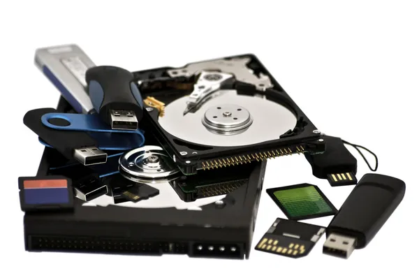

# DISPOSITIVOS DE ALMACENAMIENTO

> En este proyecto hablaremos un poco sobre los diferentes tipos de dispositivos de almacenamiento que existen.

Tarea: Periféricos

Debe seguir el siguiente menú:

1.- Definición del períférico (Con una imagen) - Alejandro

2.-Características principales  (Breves) - Ildefonso
 
3.- Tipos - Jesús, Alejandro e Ildefonso

4.- Ejemplos comerciales (Explicando las características) - Jesús, Alejandro e Ildefonso

5.- Conclusiones - Jesús

Hay añadir referencias, licencia y autores - Alejandro

Posteriormente hay que exponer el trabajo.
