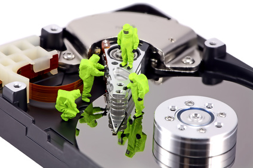

# CARACTERÍSTICAS PRINCIPALES 🚀

---

## Capacidad 📊

Mide la cantidad de datos que el sistema de almacenamiento puede contener, expresada en bytes (habitualmente Gigabytes o Terabytes).

## Rendimiento ⚡

Evalúa la rapidez y eficiencia del sistema de almacenamiento de datos, considerando factores como la velocidad de lectura/escritura, latencia y transferencia de datos.

## Fiabilidad 🛡️

Se refiere a la disponibilidad de los datos cuando son requeridos, así como a la presencia de una baja tasa de errores o fallos. Estrategias como la configuración RAID se utilizan para mejorar la fiabilidad.

## Recuperabilidad 🔄
Es la capacidad del sistema para recuperar datos después de eventos como pérdida, borrado, corrupción u otros incidentes que impidan el acceso a los mismos.

---

# Caracteristicas principales de cada tipo

## HDD:

* **Tipo:** Disco magnético con partes móviles.
* **Capacidad:** Mayor capacidad de almacenamiento, generalmente desde 500 gigabytes (GB) hasta varios terabytes (TB).
* **Velocidad:** Más lento en comparación con SSD, con velocidades típicas de lectura/escritura de 80-160 MB/s.
* **Durabilidad:** Menos duradero que SSD y M.2. Mayor susceptibilidad a fallas mecánicas.

## SSD:

* **Tipo:** Basado en memoria flash (SATA o NVMe).
* **Velocidad:** Rápido, con velocidades típicas de lectura/escritura de hasta 550/520 megabytes por segundo (MB/s) para SATA, y mucho más altas para NVMe.
* **Durabilidad:** Sin partes móviles, más duradero. Vida útil medida en escrituras totales (TBW - terabytes written).

## M.2:

* **Tipo:** Conexión directa a la placa base.
* **Tamaño y Forma:** Variedad de tamaños (NVMe más rápido).
* **Velocidad:** Muy rápida, con velocidades de lectura/escritura de hasta varios gigabytes por segundo (GB/s) para NVMe.
