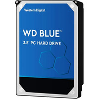

# Disco HDD

### Western Digital Blue HDD 1TB 7200rpm SATA3

Marca: Western Digital

Capacidad de almacenamiento: 1TB

Velocidad de rotación: 7200rpm

Interfaz de conexión: SATA3

Precio: 56,10€

**Enlace al hacer click en la imagen**

