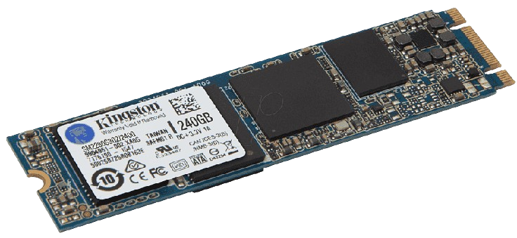

# DEFINICIÓN DEL PERIFÉRICO

## ¿Qué es un disco duro?
Es un dispositivo de almacenamiento usado en ordenadores y que posee una tecnología que trabaja para almacenar el sistema operativo, las aplicaciones y los archivos para que tu ordenador funcione correctamente. Este trabaja en conjunto con los demás componentes para facilitarle al usuario las aplicaciones y los archivos cuando los necesite.

  
