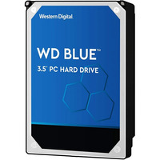
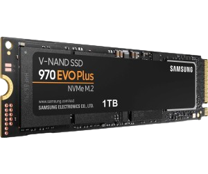

# 1. 💻 Disco HDD

## 📀 Western Digital Blue HDD 1TB 7200rpm SATA3

* 📄 **Marca:** Western Digital

* 💾 **Capacidad de almacenamiento:** 1TB

* 🌀 **Velocidad de rotación:** 7200rpm

* 🔌 **Interfaz de conexión:** SATA3

* 📊 **Tamaño del HDD:** 3.5"

* 💰 **Precio:** 56,10€

**Enlace al hacer click en la imagen**

----

# 2. 💻 Disco SSD

----

# 3. 💻 SSD NVMe M.2

## 📀 Samsung 970 EVO Plus

* 💾 **Capacidad de almacenamiento:** 1TB

* 🚀 Velocidades Asombrosas:** velocidades de lectura de hasta 3,500 MB/s y escritura de 3,300 MB/s.
  
* 🔥 Rendimiento sin Compromisos:** Perfecto para gaming y edición de contenido gracias a su alta velocidad y baja latencia.

* 🔌 **Interfaz de conexión:** PCI Express 3.0.

* 📊 **Tamaño:** Ancho: 80,2 mm Profundidad: 2,38 mm Altura: 22,1 mm"

* 💰 **Precio:** 95,99€

**Enlace al hacer click en la imagen**

https://www.pccomponentes.com/samsung-970-evo-plus-1tb-ssd-nvme-m2)
