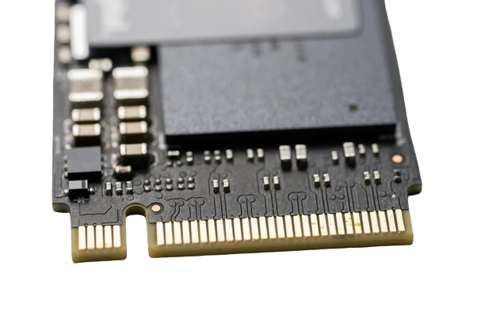

# SSD NVMe M.2:

El *SSD NVMe M.2* representa la vanguardia en almacenamiento sólido, combinando una interfaz NVMe eficiente con un formato compacto y un rendimiento excepcional. Su versatilidad lo convierte en la elección perfecta para diversas aplicaciones, desde sistemas operativos hasta experiencias multimedia y juegos intensivos.

## Características:

* **Interfaz NVMe:** Eficiencia y velocidad de vanguardia.
* **Formato M.2:** Diseño compacto y sin cables.
* **Velocidades Elevadas:** Transferencias rápidas para un rendimiento ágil.
* **Baja Latencia y Eficiencia Energética:** Respuestas instantáneas y mayor duración de la batería.
* **Diversas Capacidades:** Desde pequeñas a grandes, se adapta a tus necesidades.
 

## Uso Común:

* **Almacenamiento de SO:** Arranques rápidos y eficiencia.
* **Edición Multimedia:** Fluidez en el manejo de grandes archivos.
* **Juegos Rápidos:** Carga instantánea para una experiencia sin esperas.

🚀 ¡Experimenta el futuro del almacenamiento con SSD NVMe M.2!

## ¿Por Qué NVMe M.2?

Estos SSDs no solo ofrecen rendimiento, sino también un diseño compacto y sin cables. ¡Experimenta la revolución del almacenamiento con NVMe M.2 y lleva tu computadora a nuevas alturas! 🚀

## Enlaces utilizados
https://www.pccomponentes.com/que-es-nvme-en-ssd-deberia-tenerlo
https://www.kingston.com/es/blog/pc-performance/two-types-m2-vs-ssd
