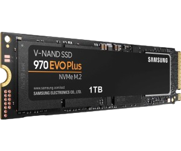
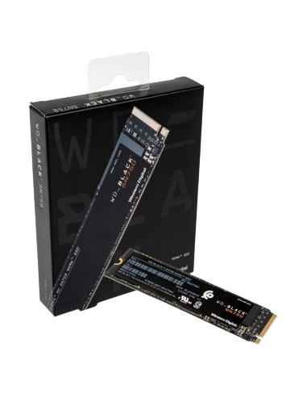
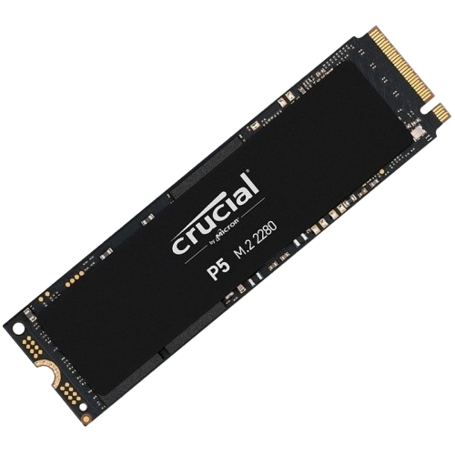

**SSD NVMe M.2:**

El *SSD NVMe M.2* representa la vanguardia en almacenamiento sólido, combinando una interfaz NVMe eficiente con un formato compacto y un rendimiento excepcional. Su versatilidad lo convierte en la elección perfecta para diversas aplicaciones, desde sistemas operativos hasta experiencias multimedia y juegos intensivos.

### Características:

- **Interfaz NVMe:** Eficiencia y velocidad de vanguardia.
- **Formato M.2:** Diseño compacto y sin cables.
- **Velocidades Elevadas:** Transferencias rápidas para un rendimiento ágil.
- **Baja Latencia y Eficiencia Energética:** Respuestas instantáneas y mayor duración de la batería.
- **Diversas Capacidades:** Desde pequeñas a grandes, se adapta a tus necesidades.
 

### Uso Común:

- **Almacenamiento de SO:** Arranques rápidos y eficiencia.
- **Edición Multimedia:** Fluidez en el manejo de grandes archivos.
- **Juegos Rápidos:** Carga instantánea para una experiencia sin esperas.

🚀 ¡Experimenta el futuro del almacenamiento con SSD NVMe M.2!

# Ejemplos comerciales

# 💻 SSD NVMe M.2: ¡algunos ejemplos que puedes comprar!

## 1. Samsung 970 EVO Plus

- **🚀 Velocidades Asombrosas:** Disfruta de velocidades de lectura de hasta 3,500 MB/s y escritura de 3,300 MB/s.
- **🔥 Rendimiento sin Compromisos:** Perfecto para gaming y edición de contenido gracias a su alta velocidad y baja latencia.
- **💡 Tecnología V-NAND 3-bit MLC:** Mayor durabilidad y eficiencia energética para un rendimiento constante.

## 2. Western Digital Black SN750

- **⚙️ Tecnología 3D NAND:** Almacenamiento fiable y rápido para tus aplicaciones más exigentes.
- **🕹️ Ideal para Gaming:** Carga tus juegos en segundos y disfruta de una experiencia gaming sin interrupciones.
- **🌐 Dashboard WD BLACK:** Monitorea el rendimiento y personaliza la iluminación RGB con facilidad.

## 3. Crucial P5

- **📈 Rendimiento Consistente:** Velocidades de hasta 3,400 MB/s para una respuesta instantánea.
- **🔒 Seguridad de Datos:** Protege tu información con cifrado de hardware AES de 256 bits.
- **🔄 Tecnología NVMe PCIe Gen3:** Aprovecha al máximo la interfaz NVMe para un rendimiento óptimo.

### ¿Por Qué NVMe M.2?

Estos SSDs no solo ofrecen rendimiento, sino también un diseño compacto y sin cables. ¡Experimenta la revolución del almacenamiento con NVMe M.2 y lleva tu computadora a nuevas alturas! 🚀
