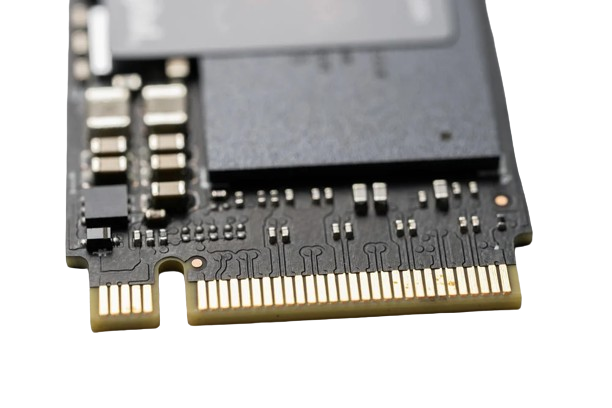

# TIPOS

## HDD

> Un disco duro (HDD, por sus siglas en inglés "Hard Disk Drive") es un dispositivo de almacenamiento no volátil que utiliza discos magnéticos para almacenar datos.

A continuación, se presentan algunas de las características principales de los discos duros:

1. **Capacidad de Almacenamiento:** Los discos duros vienen en una variedad de capacidades, desde gigabytes (GB) hasta terabytes (TB) y, más recientemente, petabytes (PB). La capacidad de almacenamiento es una de las características más destacadas y varía según el modelo y la marca del disco duro.

2. **Tecnología de Grabación Magnética:** Los discos duros utilizan la tecnología de grabación magnética para almacenar datos en discos recubiertos de material magnético. Los datos se almacenan en pistas y sectores.

3. **Velocidad de Rotación:** La velocidad de rotación de un disco duro se mide en revoluciones por minuto (RPM). Las unidades de disco duro pueden tener velocidades típicas de 5,400 RPM, 7,200 RPM o más para ofrecer un acceso más rápido a los datos.

4. **Interfaz de Conexión:** La interfaz de conexión determina cómo el disco duro se conecta y comunica con otros componentes del ordenador. Las interfaces comunes incluyen SATA (Serial ATA) y, e unos más antiguos, IDE (Integrated Drive Electronics).

5. **Formato de tamaño:** Los discos duros están disponibles en diferentes tamaños físicos, siendo los más comunes los de 3.5 pulgadas para computadoras de escritorio y los de 2.5 pulgadas para laptops.

----

## SSD

> Las unidades de estado sólido o SSD (Solid State Drive) son una alternativa a los discos duros. La gran diferencia es que mientras los discos duros utilizan componentes mecánicos que se mueven, las SSD almacenan los archivos en microchips con memorias flash interconectadas entre sí.

### Ventajas en diferentes áreas:

* **Empresas:** Las empresas que trabajan con grandes cantidades de datos (como los entornos de programación, las empresas de análisis de datos o las compañías financieras) suelen confiar en las unidades SSD, ya que los tiempos de acceso y la velocidad de transferencia de archivos son fundamentales.
* **Juegos:** Los ordenadores de juegos siempre han superado los límites de la tecnología actual, optando por equipos más caros para aumentar el rendimiento de los juegos. Esto es especialmente cierto para el almacenamiento, ya que los juegos modernos cargan y escriben constantemente archivos (texturas, mapas, niveles, personajes). Las nuevas consolas de juegos, como la PS5 y la Xbox Serie X, utilizan ahora unidades SSD en lugar de discos duros.
* **Movilidad:** Las SSD requieren poca energía, lo que contribuye a mejorar la duración de la batería en los ordenadores portátiles y las tabletas. Además, resisten los impactos, lo que reduce la probabilidad de pérdida de datos en caso de caída de un dispositivo móvil.
* **Servidores:** Los servidores de las empresas necesitan unidades SSD para obtener tiempos de lectura y escritura rápidos para servir adecuadamente a sus PC clientes.

----

## SSD NVMe M.2

> El *SSD NVMe M.2* representa la vanguardia en almacenamiento sólido, combinando una interfaz NVMe eficiente con un formato compacto y un rendimiento excepcional. Su versatilidad lo convierte en la elección perfecta para diversas aplicaciones, desde sistemas operativos hasta experiencias multimedia y juegos intensivos.

### Características:

* **Interfaz NVMe:** Eficiencia y velocidad de vanguardia.
* **Formato M.2:** Diseño compacto y sin cables.
* **Velocidades Elevadas:** Transferencias rápidas para un rendimiento ágil.
* **Baja Latencia y Eficiencia Energética:** Respuestas instantáneas y mayor duración de la batería.
* **Diversas Capacidades:** Desde pequeñas a grandes, se adapta a tus necesidades.
 

### Uso Común:

* **Almacenamiento de SO:** Arranques rápidos y eficiencia.
* **Edición Multimedia:** Fluidez en el manejo de grandes archivos.
* **Juegos Rápidos:** Carga instantánea para una experiencia sin esperas.

🚀 ¡Experimenta el futuro del almacenamiento con SSD NVMe M.2!

### 쯇or Qué NVMe M.2?

Estos SSDs no solo ofrecen rendimiento, sino también un diseño compacto y sin cables. ¡Experimenta la revolución del almacenamiento con NVMe M.2 y lleva tu computadora a nuevas alturas! 🚀
